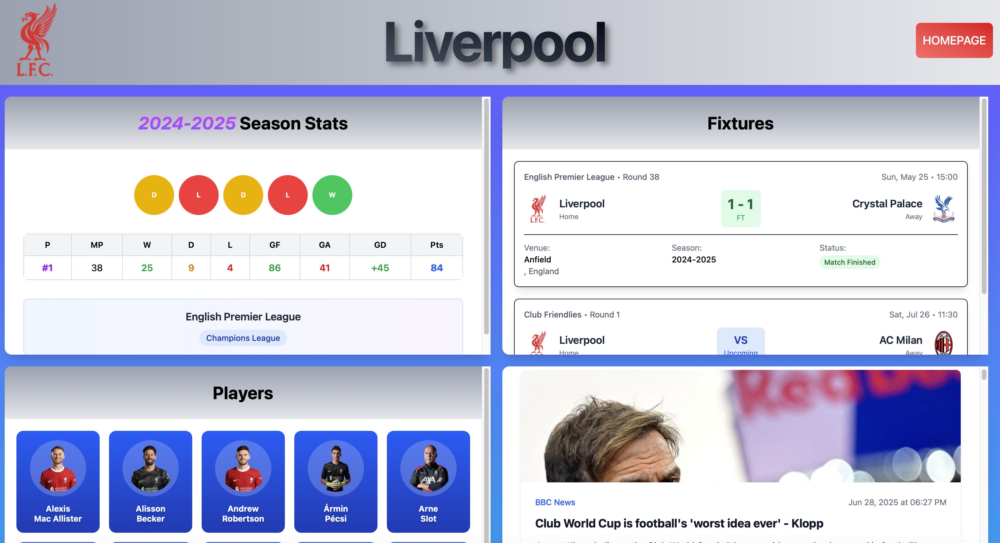
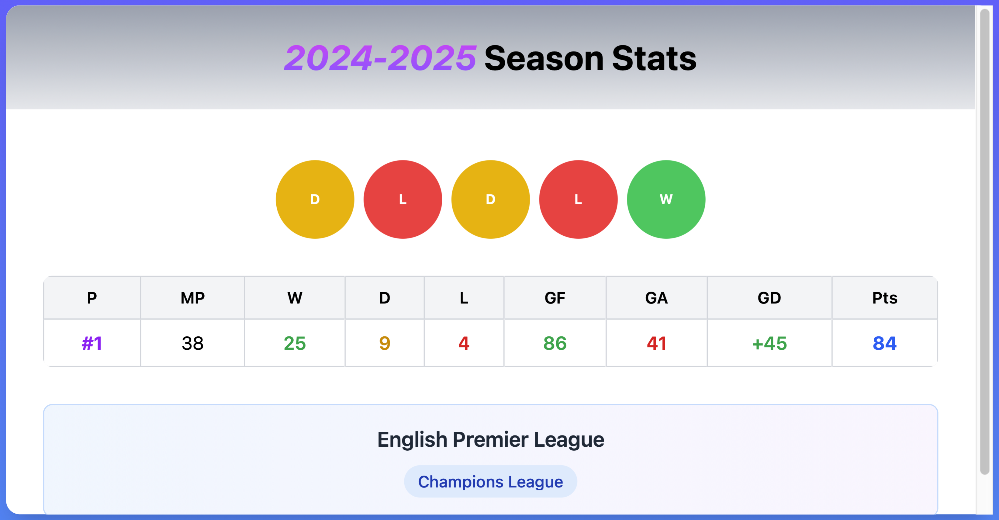
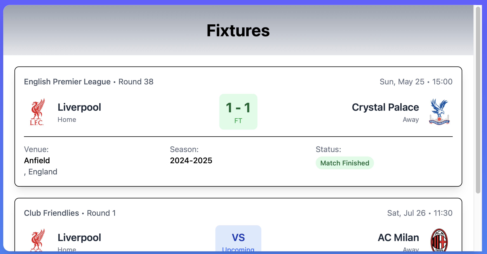
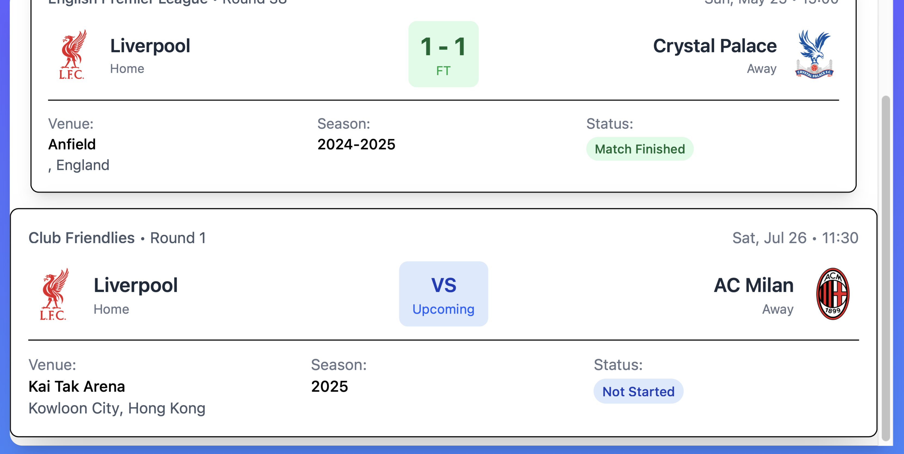
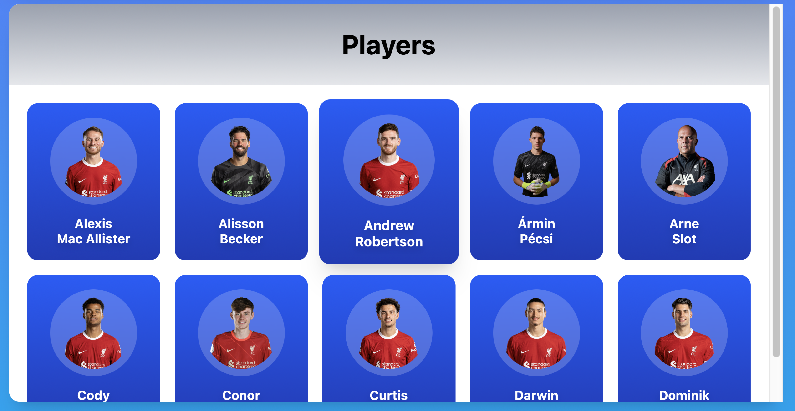
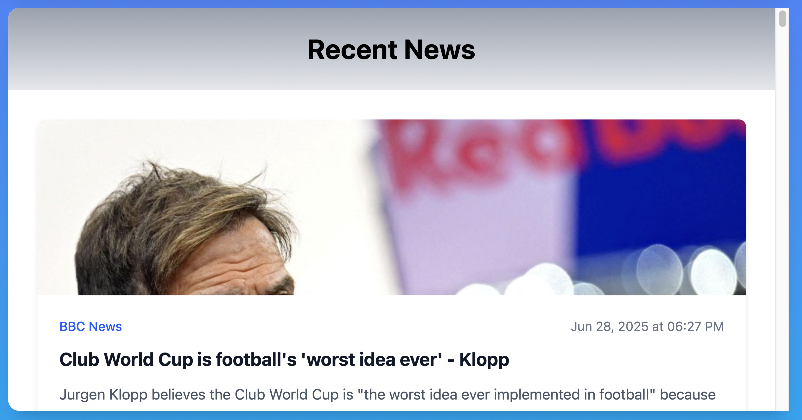

# Footy Fan Hub App ⚽

A modern React-based football tracking application that allows fans to follow their favorite teams with real-time data, stunning visuals, and a responsive design. Built with Vite, React Router, and Tailwind CSS for optimal performance and user experience.


## 📱 Screenshots

### Welcome Screen
Beautiful hero section with football stadium background and gradient overlays.


### Team Selection
Modal overlay with searchable team cards featuring official club badges.


### Team Dashboard  
Comprehensive view showing season stats, fixtures, players, and latest news.








## ✨ Features

- **🏠 Dynamic Welcome Screen** - Beautiful gradient hero section with interactive team selection
- **🔍 Smart Team Search** - Debounced search with real-time filtering
- **⚽ Personalized Team Selection** - Choose any team and all data dynamically updates
- **📊 Comprehensive Team Stats** - Season statistics with visual indicators (W/L/D circles)
- **📅 Live Fixtures** - Past and upcoming matches with detailed information
- **👥 Player Profiles** - Team roster with player cards and images
- **📰 Latest News** - Real-time football news filtered by selected team
- **🔄 Dynamic API Calls** - All endpoints update based on your chosen team ID
- **📱 Fully Responsive** - Fluid design across all devices with custom breakpoints
- **⚡ SPA Navigation** - Seamless page transitions without refreshing
- **🎨 Custom Design System** - Modular Tailwind CSS with custom themes and components

## 🛠️ Tech Stack

**Frontend Framework:**
- **React 19** - Latest React with modern hooks
- **Vite** - Lightning-fast build tool and dev server
- **React Router Dom** - Client-side routing with state passing

**Styling & UI:**
- **Tailwind CSS 4** - Utility-first CSS framework with custom themes
- **Custom CSS Components** - Modular design system using `@layer` and `@apply`
- **Google Fonts** - Oswald font family for sporty typography
- **Responsive Design** - Mobile-first approach with custom breakpoints

**Data & APIs:**
- **TheSportsDB API** - Free tier for team data, fixtures, and players
- **News API** - Real-time football news integration
- **Environment Variables** - Secure API key management

**Development Tools:**
- **React Hooks** - useState, useEffect, useDebounce for state management
- **Custom Hooks** - Optimized data fetching and error handling

## 🚀 Getting Started

### Prerequisites

- Node.js (v18.0 or higher)
- npm
- TheSportsDB API key (free tier available)
- News API key

### Installation

1. **Clone the repository**
   ```bash
   git clone https://github.com/GeorgeTheGGamer/Footy-Fan-Hub-App.git
   cd Footy-Fan-Hub-App
   ```

2. **Install dependencies**
   ```bash
   npm install
   ```

3. **Set up environment variables**
   Create a `.env.local` file in the root directory:
   Free tier for sportdb is `123`
   ```env
   VITE_SPORTSDB_API_KEY=your_sportsdb_api_key_here
   VITE_NEWS_API_KEY=your_news_api_key_here
   ```

4. **Start the development server**
   ```bash
   npm run dev
   ```

5. **Open your browser**
   Navigate to `http://localhost:5173` to view the application.

## ⚽ Dynamic Team Selection System

The app's core functionality revolves around **dynamic team-based data fetching**. Once you select a team from the welcome screen, the entire application adapts to show information specific to your chosen club.

### How It Works

1. **Team Selection** - Choose from Premier League teams (Liverpool, Arsenal, Manchester City, etc.)
2. **State Management** - Selected team data is passed through React Router state
3. **Dynamic API Calls** - All subsequent API endpoints use the team's unique ID
4. **Real-time Updates** - Every section updates automatically with your team's data

### Team-Specific Data Fetching

```javascript
// Example: Fixtures component dynamically fetches based on team ID
const fetchTeams = async () => {
  const endpoint1 = `${API_BASE_URL}/eventslast.php?id=${teamId}`  // Past matches
  const endpoint2 = `${API_BASE_URL}/eventsnext.php?id=${teamId}` // Upcoming matches
  
  // Fetch team-specific fixture data
  const response1 = await fetch(endpoint1, API_OPTIONS)
  const response2 = await fetch(endpoint2, API_OPTIONS)
}

// News API also filters by team name
const newsQuery = `${teamName} Football Club`
```

### What Changes Based on Your Team

- **Season Statistics** - Win/loss records, goals scored/conceded, league position
- **Fixture List** - Past results and upcoming matches for your specific team
- **Player Roster** - Complete squad with photos and details
- **Team News** - Latest articles mentioning your club specifically
- **Team Branding** - Club badge, colors, and identity throughout the interface

## 📊 API Integration

### TheSportsDB API
The application uses TheSportsDB's free tier which provides:
- **Team Information** - Badges, names, and basic details
- **League Tables** - Current standings and statistics  
- **Fixtures** - Past and upcoming matches
- **Player Data** - Squad information and photos

**API Limitations (Free Tier):**
- Limited to top teams in major leagues
- Rate limiting applies
- Some endpoints restricted

**Premium Upgrade Ready:**
- Simply change the API key in `.env.local`
- Full access to all teams, leagues, and historical data
- Higher rate limits and additional endpoints

### News API
- **Dynamic Queries** - Searches using "{team name} + Football Club"
- **Real-time Updates** - Latest news filtered by selected team
- **Multiple Sources** - Aggregated from various sports news outlets

## 🏗️ Project Structure

```
Football-Fan-Tracker/
├── public/
│   ├── search.svg               # Search icon for team finder
│   ├── spurs-logo.jpg          # Example team logo
│   ├── vite.svg                # Vite logo
│   └── welcome-banner.jpg      # Hero section background
├── src/
│   ├── assets/                 # Static assets and images
│   ├── components/
│   │   ├── Findteam.jsx        # Team selection overlay modal
│   │   ├── FixtureCard.jsx     # Individual match result/fixture
│   │   ├── Fixturelist.jsx     # Container for all fixtures
│   │   ├── Homepage.jsx        # Landing page component
│   │   ├── Newscard.jsx        # Individual news article card
│   │   ├── Newsfeed.jsx        # News section container
│   │   ├── Playercard.jsx      # Individual player profile card
│   │   ├── Playerviewer.jsx    # Player roster container
│   │   ├── Search.jsx          # Debounced search functionality
│   │   ├── SeasonStats.jsx     # Team statistics display
│   │   ├── Spinner.jsx         # Loading animation component
│   │   ├── Teamcard.jsx        # Team selection cards
│   │   └── Teampage.jsx        # Main team dashboard page
│   ├── App.css                 # Additional component styles
│   ├── App.jsx                 # Main application component
│   ├── index.css               # Global styles & custom Tailwind
│   └── main.jsx                # Application entry point
├── .env.local                  # Environment variables (API keys)
├── .gitignore                  # Git ignore rules
├── eslint.config.js           # ESLint configuration
├── index.html                  # HTML template
├── package.json               # Dependencies and scripts
├── package-lock.json          # Dependency lock file
├── README.md                  # Project documentation
└── vite.config.js             # Vite build configuration
```


## 🎨 Design System

### Custom Tailwind Components

**Welcome Banner**
```css
.welcome-banner {
  @apply bg-[url(/welcome-banner.jpg)] h-[60vh] bg-cover bg-center bg-no-repeat relative flex justify-center items-start;
}
```

**Team Cards**
```css
.team-card {
  @apply bg-gray-400 rounded-lg pt-3 pl-3 pr-3 pb-3 flex flex-col justify-between items-center gap-3 hover:shadow-2xl overflow-hidden h-full hover:scale-105;
}
```


## 🔧 Key Features Implementation

### Debounced Search
```javascript
import { useDebounce } from 'react-use'

// Delay search term by 500ms to optimize API calls
useDebounce(() => setdebouncedSearchTerm(searchTerm), 500, [searchTerm])
```

### State Management with React Router
```javascript
const navigate = useNavigate()

const handleClick = () => {
  // Pass complete team object through router state for immediate access
  navigate(`/team/${team.idTeam}`, {state: {team}})
}

// In TeamPage component - access the team data and use team ID for all API calls
const { teamId } = useParams()
const { team } = useLocation().state

// All subsequent API calls use this teamId parameter
useEffect(() => {
  if (teamId) {
    fetchTeamStats(teamId)
    fetchTeamFixtures(teamId) 
    fetchTeamPlayers(teamId)
    fetchTeamNews(team.strTeam) // Use team name for news queries
  }
}, [teamId])
```

### Error Handling & Loading States
```javascript
const [isLoading, setisLoading] = useState(false)
const [errorMessage, seterrorMessage] = useState('')

// Comprehensive error handling for all API calls
try {
  const response = await fetch(endpoint, API_OPTIONS)
  if (!response.ok) throw new Error('Failed to fetch data')
} catch (error) {
  seterrorMessage('Error fetching data. Please try again later.')
}
```

## 🔒 Environment Variables

Required environment variables in `.env.local`:

```env
# TheSportsDB API (Free tier available)
VITE_SPORTSDB_API_KEY=your_api_key_here

# News API for real-time news
VITE_NEWS_API_KEY=your_news_api_key_here
```


- [ ] Performance analytics dashboard

## 🐛 Known Limitations

- **API Constraints**: Free tier limits team selection to major leagues
- **Rate Limiting**: API calls are throttled on free tier
- **News Filtering**: Results depend on team name + "Football Club" query accuracy

## 📄 Dependencies
At date of publication 23/07/25
```json
{
  "react": "^19.1.0",
  "react-dom": "^19.1.0",
  "react-router": "^7.6.3",
  "react-router-dom": "^7.6.3",
  "react-use": "^17.6.0",
  "tailwindcss": "^4.1.11"
}
```
