 Footy Fan Hub App ⚽

A full-stack football tracking application that allows fans to follow their favorite teams with real-time data, user authentication, and personalized experiences. Built with Django REST Framework backend and React frontend for optimal performance and scalability.


## 📱 Screenshots

### Welcome Screen
Beautiful football with football stadium background and gradient overlays. Reactive Buttons
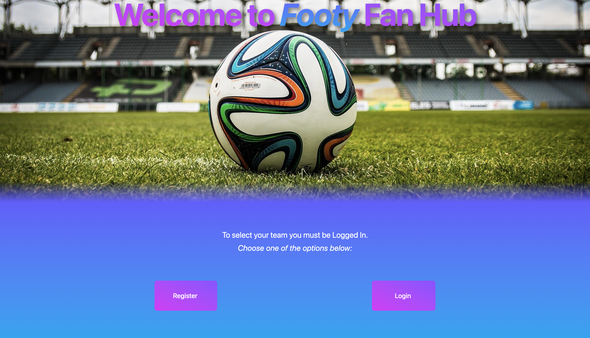
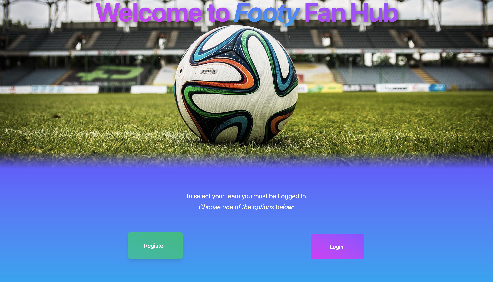

### User Authentication
Secure login and registration system with protected routes.
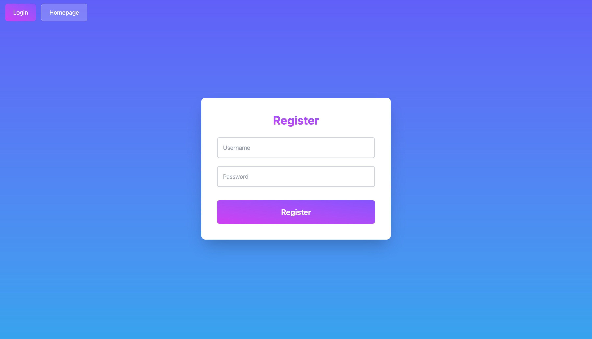
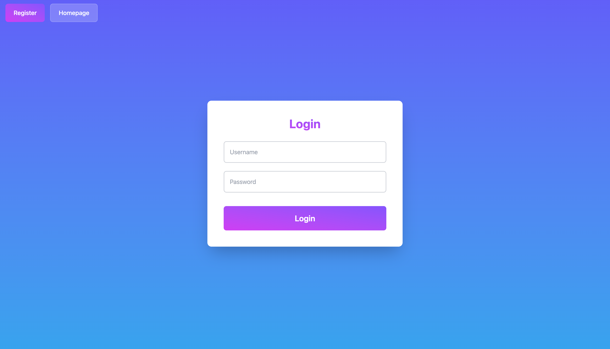

### User Homepage
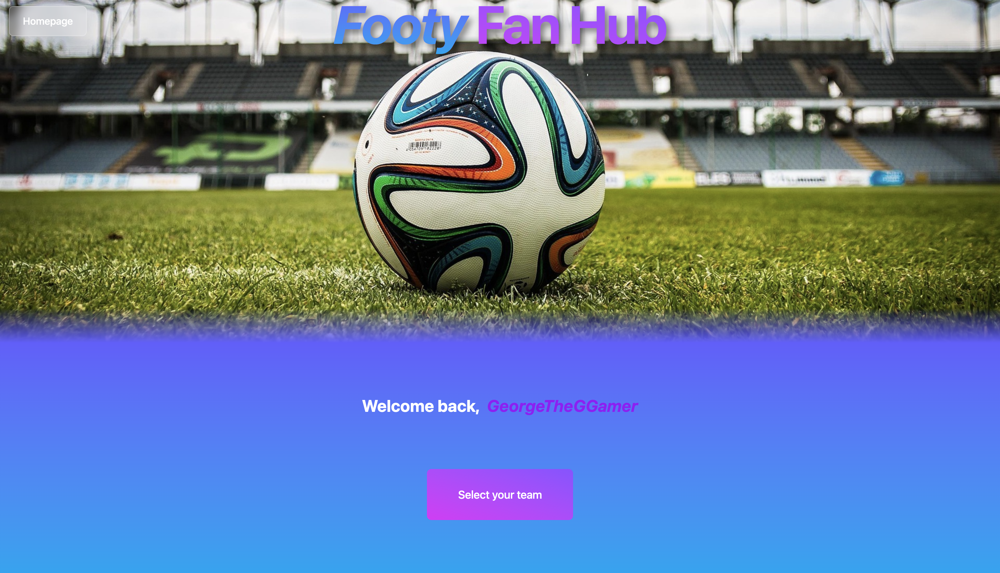

### Team Selection
Modal overlay with searchable team cards featuring official club badges.
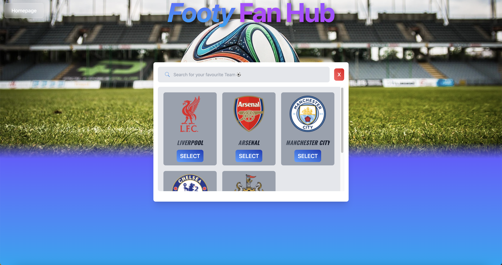

### Team Dashboard  
Comprehensive view showing season stats, fixtures, players, and latest news.
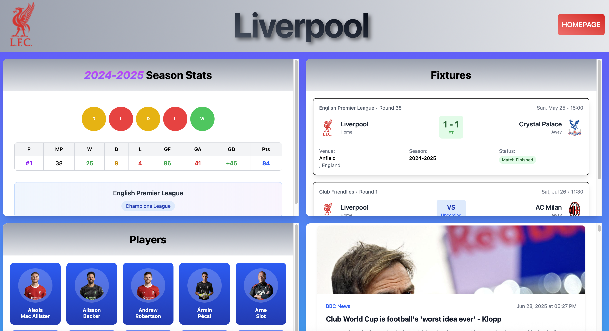
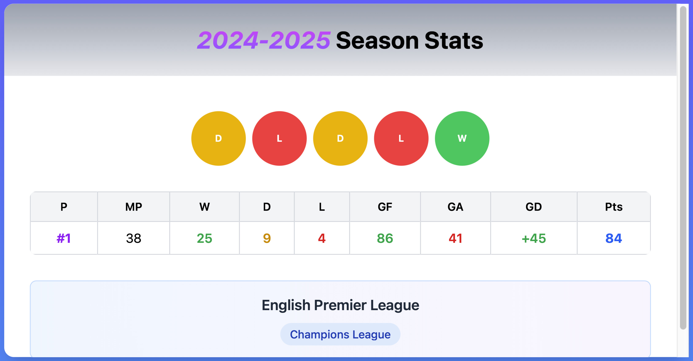
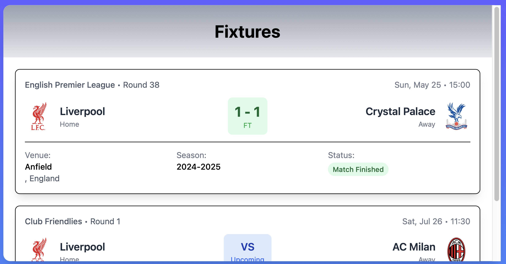
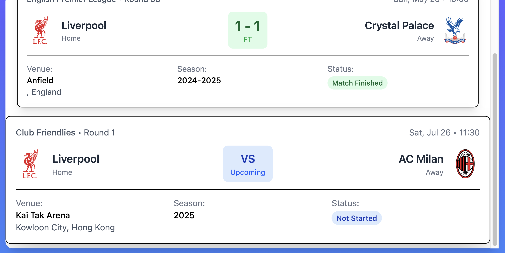
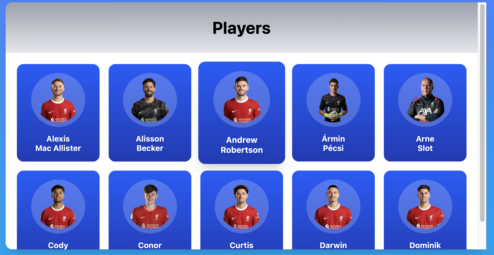


### 404 Page Not Found


## ✨ Features

### 🔐 User Authentication & Personalization
- **User Registration & Login** - Secure authentication with Django REST Framework
- **Protected Routes** - Access control for authenticated users only
- **Persistent Team Selection** - Your chosen team is saved and restored on login
- **Personalized Welcome** - Dashboard displays your username and preferences
- **Smart Redirects** - Returning users go directly to their team page

### ⚽ Football Features
- **🏠 Dynamic Welcome Screen** - Beautiful gradient hero section with interactive team selection
- **🔍 Smart Team Search** - Debounced search with real-time filtering
- **📊 Comprehensive Team Stats** - Season statistics with visual indicators (W/L/D circles)
- **📅 Live Fixtures** - Past and upcoming matches with detailed information
- **👥 Player Profiles** - Team roster with player cards and images
- **📰 Latest News** - Real-time football news filtered by selected team
- **🔄 Dynamic API Calls** - All endpoints update based on your chosen team ID

### 🎨 Technical Features
- **📱 Fully Responsive** - Fluid design across all devices with custom breakpoints
- **⚡ SPA Navigation** - Seamless page transitions without refreshing
- **🎨 Custom Design System** - Modular Tailwind CSS with custom themes and components
- **🔒 API Security** - Protected endpoints with authentication requirements

## 🛠️ Tech Stack

### Backend
- **Django 5.x** - High-level Python web framework
- **Django REST Framework** - Powerful toolkit for building Web APIs
- **Simple JWT** - JSON Web Token authentication for Django REST Framework
- **SQLite** - Lightweight database for development
- **CORS Headers** - Cross-origin resource sharing support

### Frontend
- **React 19** - Latest React with modern hooks
- **Vite** - Lightning-fast build tool and dev server
- **React Router Dom** - Client-side routing with protected routes

### Styling & UI
- **Tailwind CSS 4** - Utility-first CSS framework with custom themes
- **Custom CSS Components** - Modular design system using `@layer` and `@apply`
- **Google Fonts** - Oswald font family for sporty typography
- **Responsive Design** - Mobile-first approach with custom breakpoints

### APIs & Data
- **TheSportsDB API** - Team data, fixtures, and players
- **News API** - Real-time football news integration
- **Environment Variables** - Secure API key management

## 🚀 Getting Started

### Prerequisites

- Python 3.8+
- Node.js (v18.0 or higher)
- npm
- TheSportsDB API key (free tier available)
- News API key

### Backend Setup (Django)

1. **Navigate to backend directory**
   ```bash
   cd backend
   ```

2. **Create virtual environment**
   ```bash
   python -m venv venv
   source venv/bin/activate  # On Windows: venv\Scripts\activate
   ```

3. **Install Python dependencies**
   ```bash
   pip install -r requirements.txt
   ```

4. **Set up environment variables**
   Create a `.env` file in the backend directory:
   ```env
   SECRET_KEY=your_django_secret_key_here
   DEBUG=True
   ALLOWED_HOSTS=localhost,127.0.0.1
   ```

5. **Run migrations**
   ```bash
   python manage.py makemigrations
   python manage.py migrate
   ```

6. **Create superuser (optional)**
   ```bash
   python manage.py createsuperuser
   ```

7. **Start Django development server**
   ```bash
   python manage.py runserver
   ```

### Frontend Setup (React)

1. **Navigate to frontend directory**
   ```bash
   cd frontend
   ```

2. **Install dependencies**
   ```bash
   npm install
   ```

3. **Set up environment variables**
   Create a `.env.local` file in the frontend directory:
   ```env
   VITE_SPORTSDB_API_KEY=your_sportsdb_api_key_here
   VITE_NEWS_API_KEY=your_news_api_key_here
   VITE_API_BASE_URL=http://localhost:8000/api
   ```

4. **Start the development server**
   ```bash
   npm run dev
   ```

5. **Open your browser**
   Navigate to `http://localhost:5173` to view the application.

## 🏗️ Project Structure

```
Footy-Fan-Hub-App/
├── backend/                    # Django backend
│   ├── api/                   # Django app for API endpoints
│   │   ├── __pycache__/
│   │   ├── migrations/
│   │   ├── __init__.py
│   │   ├── admin.py
│   │   ├── apps.py
│   │   ├── models.py          # User team choice model
│   │   ├── serializers.py     # DRF serializers
│   │   ├── tests.py
│   │   └── views.py           # API views (login, logout, user info)
│   ├── backend/               # Django project settings
│   │   ├── __pycache__/
│   │   ├── __init__.py
│   │   ├── asgi.py
│   │   ├── settings.py        # Django configuration
│   │   ├── urls.py            # URL routing
│   │   └── wsgi.py
│   ├── db.sqlite3             # SQLite database
│   ├── manage.py              # Django management script
│   └── requirements.txt       # Python dependencies
├── frontend/                  # React frontend
│   ├── dist/                  # Build output
│   ├── node_modules/          # npm dependencies
│   ├── public/                # Static assets
│   │   ├── search.svg
│   │   ├── spurs-logo.jpg
│   │   ├── vite.svg
│   │   └── welcome-banner.jpg
│   ├── src/
│   │   ├── assets/            # Static assets and images
│   │   ├── components/        # React components
│   │   │   ├── Findteam.jsx   # Team selection modal
│   │   │   ├── FixtureCard.jsx
│   │   │   ├── Fixturelist.jsx
│   │   │   ├── Form.jsx       # Login/Register forms
│   │   │   ├── Newscard.jsx
│   │   │   ├── Newsfeed.jsx
│   │   │   ├── Playercard.jsx
│   │   │   ├── Playerviewer.jsx
│   │   │   ├── ProtectedRoute.jsx  # Route protection
│   │   │   ├── Search.jsx
│   │   │   ├── SeasonStats.jsx
│   │   │   ├── Spinner.jsx
│   │   │   ├── Teamcard.jsx
│   │   │   └── Teampage.jsx
│   │   ├── pages/             # Page components
│   │   │   ├── Homepage.jsx   # Protected dashboard
│   │   │   ├── Login.jsx      # Login page
│   │   │   ├── NotFound.jsx   # 404 page
│   │   │   ├── Register.jsx   # Registration page
│   │   │   └── SignedInHomepage.jsx  # User dashboard
│   │   ├── api.js             # API configuration
│   │   ├── App.css            # Component styles
│   │   ├── App.jsx            # Main app component
│   │   ├── constants.js       # App constants
│   │   ├── index.css          # Global styles
│   │   └── main.jsx           # App entry point
│   ├── .env.local             # Environment variables
│   ├── .gitignore
│   ├── eslint.config.js
│   ├── index.html
│   ├── package.json
│   ├── package-lock.json
│   └── vite.config.js
├── env/                       # Python virtual environment
├── readme_images/             # README screenshots
├── README.md                  # Project documentation
└── requirements.txt           # Python dependencies (root)
```

## 🔐 Authentication System

### User Model & Team Persistence
The application includes a custom user system that stores team preferences:

```python
# models.py
class TeamChoice(models.Model):
    user = models.OneToOneField(User, on_delete=models.CASCADE)
    team_data = models.JSONField()  # Stores complete team object
    created_at = models.DateTimeField(auto_now_add=True)
    updated_at = models.DateTimeField(auto_now=True)
```

### API Endpoints
- **POST /api/user/register/** - User registration
- **POST /api/token/** - JWT token authentication (login)
- **POST /api/token/refresh/** - Refresh JWT access token
- **GET /api/user/details** - Retrieve authenticated user information
- **POST /api/team/** - Save user's team selection
- **GET /api/team/get/** - Retrieve user's saved team choice

### Protected Routes
Frontend routes are protected using the `ProtectedRoute` component:

```jsx
// App.jsx routing structure
<Routes>
  <Route path="/login" element={<Login />} />
  <Route path="/register" element={<Register />} />
  <Route path="/" element={
    <ProtectedRoute>
      <SignedInHomepage />
    </ProtectedRoute>
  } />
  <Route path="/team/:teamId" element={
    <ProtectedRoute>
      <Teampage />
    </ProtectedRoute>
  } />
</Routes>
```

## ⚽ Dynamic Team Selection System

### Enhanced User Experience Flow

1. **First Time Users**
   - Register/Login → Protected Dashboard → Team Selection → Team Data Saved
   
2. **Returning Users**  
   - Login → Automatic redirect to saved team page (if team previously selected)
   - Or Dashboard → Choose new team → Updated team data saved

3. **State Management**
   - Team selection persisted in Django database
   - Frontend state management with React Router
   - Seamless navigation between authenticated pages

### Team-Specific Data Fetching

```javascript
// Example: Dynamic API calls based on authenticated user's team
const fetchUserTeamData = async () => {
  // Get user's saved team from Django backend
  const accessToken = localStorage.getItem('accessToken')
  const userTeamResponse = await fetch('/api/team/get/', {
    headers: { 'Authorization': `Bearer ${accessToken}` }
  })
  
  const teamData = await userTeamResponse.json()
  const teamId = teamData.team_data.idTeam
  
  // Fetch team-specific data from sports API
  const fixturesResponse = await fetch(
    `${SPORTS_API_BASE}/eventslast.php?id=${teamId}`
  )
}
```

## 🔧 Key Features Implementation

### User Authentication Flow
```javascript
// Login component with Django Simple JWT integration
const handleLogin = async (credentials) => {
  const response = await fetch('/api/token/', {
    method: 'POST',
    headers: { 'Content-Type': 'application/json' },
    body: JSON.stringify(credentials)
  })
  
  if (response.ok) {
    const { access, refresh } = await response.json()
    localStorage.setItem('accessToken', access)
    localStorage.setItem('refreshToken', refresh)
    
    // Check if user has saved team
    const teamChoice = await fetchUserTeamChoice()
    if (teamChoice) {
      navigate(`/team/${teamChoice.team_data.idTeam}`)
    } else {
      navigate('/')
    }
  }
}
```

### Protected Route Implementation
```jsx
const ProtectedRoute = ({ children }) => {
  const [isAuthenticated, setIsAuthenticated] = useState(null)
  
  useEffect(() => {
    const checkAuth = async () => {
      const token = localStorage.getItem('accessToken')
      if (!token) {
        setIsAuthenticated(false)
        return
      }
      
      try {
        const response = await fetch('/api/user/details', {
          headers: { 'Authorization': `Bearer ${token}` }
        })
        
        if (response.status === 401) {
          // Try to refresh token
          const refreshToken = localStorage.getItem('refreshToken')
          const refreshResponse = await fetch('/api/token/refresh/', {
            method: 'POST',
            headers: { 'Content-Type': 'application/json' },
            body: JSON.stringify({ refresh: refreshToken })
          })
          
          if (refreshResponse.ok) {
            const { access } = await refreshResponse.json()
            localStorage.setItem('accessToken', access)
            setIsAuthenticated(true)
          } else {
            setIsAuthenticated(false)
          }
        } else {
          setIsAuthenticated(response.ok)
        }
      } catch {
        setIsAuthenticated(false)
      }
    }
    
    checkAuth()
  }, [])
  
  if (isAuthenticated === null) return <Spinner />
  if (!isAuthenticated) return <Navigate to="/login" />
  
  return children
}
```

### Team Persistence
```javascript
// Save team choice to Django backend
const saveTeamChoice = async (teamData) => {
  const accessToken = localStorage.getItem('accessToken')
  await fetch('/api/team/', {
    method: 'POST',
    headers: {
      'Content-Type': 'application/json',
      'Authorization': `Bearer ${accessToken}`
    },
    body: JSON.stringify({ team_data: teamData })
  })
}

// Retrieve user's saved team
const fetchUserTeamChoice = async () => {
  const accessToken = localStorage.getItem('accessToken')
  const response = await fetch('/api/team/get/', {
    headers: { 'Authorization': `Bearer ${accessToken}` }
  })
  return response.ok ? await response.json() : null
}
```

## 🔒 Environment Variables

### Backend (.env)
```env
SECRET_KEY=your_django_secret_key_here
DEBUG=True
ALLOWED_HOSTS=localhost,127.0.0.1
DATABASE_URL=sqlite:///db.sqlite3
```

### Frontend (.env.local)
```env
# External APIs
VITE_SPORTSDB_API_KEY=your_sportsdb_api_key_here
VITE_NEWS_API_KEY=your_news_api_key_here

# Backend connection
VITE_API_BASE_URL=http://localhost:8000
```

## 🚀 Deployment

### Backend Deployment (Django)
```bash
# Production settings
python manage.py collectstatic
python manage.py migrate
gunicorn backend.wsgi:application
```

### Frontend Deployment (React)
```bash
# Build for production
npm run build

# Deploy dist/ folder to your hosting service
```

## 🐛 Known Limitations

- **API Constraints**: Free tier limits team selection to major leagues
- **Rate Limiting**: API calls are throttled on free tier  
- **Database**: SQLite for development (switch to PostgreSQL for production)
- **Token Management**: Basic JWT implementation (token refresh implemented)

## 📈 Future Enhancements

- [ ] Advanced JWT features (blacklisting, custom claims)
- [ ] PostgreSQL database migration
- [ ] User profile customization
- [ ] Team comparison features
- [ ] Push notifications for fixtures
- [ ] Social features (sharing, comments)
- [ ] Performance analytics dashboard
- [ ] Mobile app development

## 📄 Dependencies

### Backend (requirements.txt)
```txt
Django>=5.0.0
djangorestframework
djangorestframework-simplejwt
django-cors-headers
python-decouple
```

### Frontend (package.json)
```json
{
  "react": "^19.1.0",
  "react-dom": "^19.1.0",
  "react-router": "^7.6.3",
  "react-router-dom": "^7.6.3",
  "react-use": "^17.6.0",
  "axios": "^1.11.0",
  "jwt-decode": "^4.0.0",
  "tailwindcss": "^4.1.11",
  "@tailwindcss/vite": "^4.1.11"
}
```

## 🤝 Contributing

1. Fork the repository
2. Create a feature branch (`git checkout -b feature/amazing-feature`)
3. Commit your changes (`git commit -m 'Add amazing feature'`)
4. Push to the branch (`git push origin feature/amazing-feature`)
5. Open a Pull Request

## 📝 License

This project is licensed under the MIT License - see the [LICENSE](LICENSE) file for details.

## 🙏 Acknowledgments

- [TheSportsDB](https://www.thesportsdb.com/) for providing football data
- [News API](https://newsapi.org/) for real-time news feeds
- [Django REST Framework](https://www.django-rest-framework.org/) for robust API development
- [Tailwind CSS](https://tailwindcss.com/) for utility-first styling

---

⚽ **Happy Football Tracking!** Built with ❤️ by [GeorgeTheGGamer](https://github.com/GeorgeTheGGamer)
